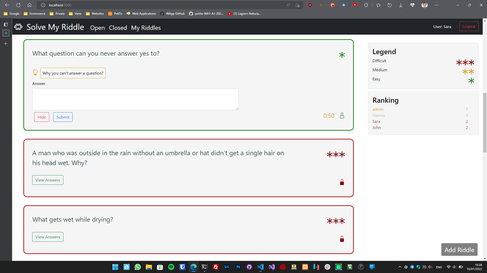

# Exam #2: "Solve My Riddle"
## Student: s281616 TREVES MATHIEU 

## React Client Application Routes

- Route `/`: main page visualized for the application, it visualizes the navbar, ranking form and a legend. Inside it we load the different pages with the list of the riddles. The list of all riddles is shown (open and closed).
- Route `/type/:filter`: filter can be "openRiddles", "closedRiddles", "myRiddles". It is used to load different lists of riddles, open, closed and the ones created by the loggedIn user, respectively.
- Route `/*`: redirect all the others path to a "not found" page
- Route `/add`: it is shown the form for creating a new riddle
- Route `/login`: it is shown the form for loggin in the application

## API Server

- POST `/api/sessions`
  - request
    - body: credentials for login
  - response
    - 200 + user info if logIn ok
    - 401 + error if not authenticated
- POST `/api/riddles`
  - request: credentials
    - body: riddle to insert in db
  - response
    - 200 + riddle inserted
    - 400 + error(s) if params validation not ok
    - 503 + error if db error
- POST `/api/answers`
  - request: credentials
    - body: answer to insert in db
  - response:
    - 200 + answer added
    - 400 + error(s) if params validation not ok
    - 503 + error if db error
  
- GET `/api/sessions/current`
  - request: credentials
  - response:
    - 200 + user info if authenticated
    - 401 + error if not authenticated
- GET `/api/listRiddles/:id`
  - request: credentials
    - param: id of riddles (all, open, closed, personal) to fetch
  - response
    - 200 + riddles
    - 500 + error if db error
- GET `/api/ranking`
  - request: credentials
  - response:
    - 200 + ranking list
    - 500 + error if db error
- GET `/api/answers/:id`
  - request: credentials
    - param: id of the riddle of which we want the answers
  - response:
    - 200 + answer
    - 400 + error(s) if params validation not ol
    - 404 if not found
    - 500 if db error
  
- PUT `/api/riddles/:id`
  - request: credentials
    - param: id of the riddle to be closed
  - response: 
    - 200 + riddle closed
    - 400 if params validation not ok
    - 503 if db error
- DELETE `/api/sessions/current`
  - request: credentials
  - response:
    - 200 if ok
    - 500 if not ok

## Database Tables

- Table `users` -> table containing the info about all the registered users
  - id : id unique to the user (incremental)
  - email: email of the user
  - username: username of the user
  - points: points aquired by the user
  - hash: password hashed of the user
  - salt: salt used when hashing the password
- Table `riddles` -> table containing all the info about the riddles inserted by the users
  - id: id unique to the riddle (incremental)
  - text: text of the riddle
  - answer: text of the answer of the riddle
  - hint1: first hint to the riddle
  - hint2: second hint to the riddle
  - difficulty: difficulty of the riddle
  - duration: time from the first answer
  - user: id of the user that created the riddle
  - rstatus: status of the riddle (open/close)
  - winner: id of the user that won the riddle
  - timestart: time at which the first answer was submitted
- Table `riddleAnswers` -> table containing all the submitted answers
  - riddleid: id of the riddle the answer is for
  - userid: id of the user that submitted the answer
  - user: username of the user that submitted the answer
  - answer: answer submitted by the user
  - correct: answer is correct/wrong (1/0)
  
## Main React Components

- `App` (in `App.js`): Main wrapper, manages the toast for the error visualization
- `Main` (in `App.js`): Used for switching routes, handle login/logout API
  
- `AppLayout` (in `PageLayout.js`): Contains the main layout of the application, visualizing the list of riddles, the ranking and navbar
- `MainLayout` (in `PageLayout.js`): Visualizes the list of riddles, and manage the polling to the server for the ranking info and riddles info
- `AddLayout` (in `PageLayout.js`): Visualizes the form for adding a riddle and send it to the server
- `LoginLayout` (in `PageLayout.js`): Visualizes the form for loggin in the application
  
- `MainNavbar` (in `NavBar.js`): Navbar of the application, used for loggin in/out, displayng the user loggedIn and switching between different pages with different lists of riddles (all, open, closed, personal)
  
- `RiddleForm` (in `RiddleList.js`): Form representing one riddle, and visualizing all its info (text, hints, answers, time), manages the polling for the answers (if the user is in one of its own open riddles), the submit of an answer
- `RiddleAnswer` (in `RiddleList.js`): Answer of a riddle, visualize the text and the user 
- `RiddlePlaceholder` (in `RiddleList.js`): Skeleton placeholder to be displayed when the list of riddles is loading
  
- `LoginForm` (in `Authentication.js`): Form for logging in the application, it validates the field inserted by the user and send them to the server to login
  
- `RankingList` (in `Ranking.js`): List of `SingleRank`, showing the pair username-points of the first three user by points
  
- `AddRiddleForm` (in `AddRiddleForm.js`): Form for adding a riddle. It validates the entries (text, answer, hints, time, difficulty) and send the riddle to the server.
  
- `Legend` (in `Legend.js`): Legend for the symbols about the difficulty of the riddles
  
- `ShowTimer` (in `ShowTimer.js`): Used to visualize the time remaining for answering a riddle. When there is a riddle whit a new answer, a timer starts calculating the time passed from the start, and closing the riddle if we reach 0. It is responsible also for reporting when the hints have to be visible.

## Screenshot

  
## Users Credentials

- admin@polito.it, admin
- paolo.verdi@polito.it, password
- sara@polito.it, pw
- john.travolta@polito.it, 1234
- gianna.nannini@polito.it, 1234
- mathieu.treves@polito.it, 123456
